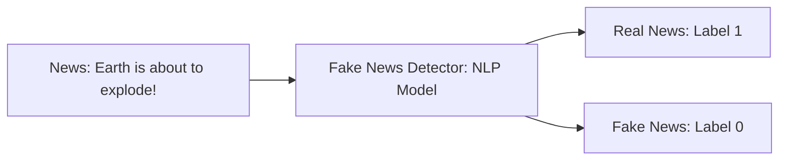
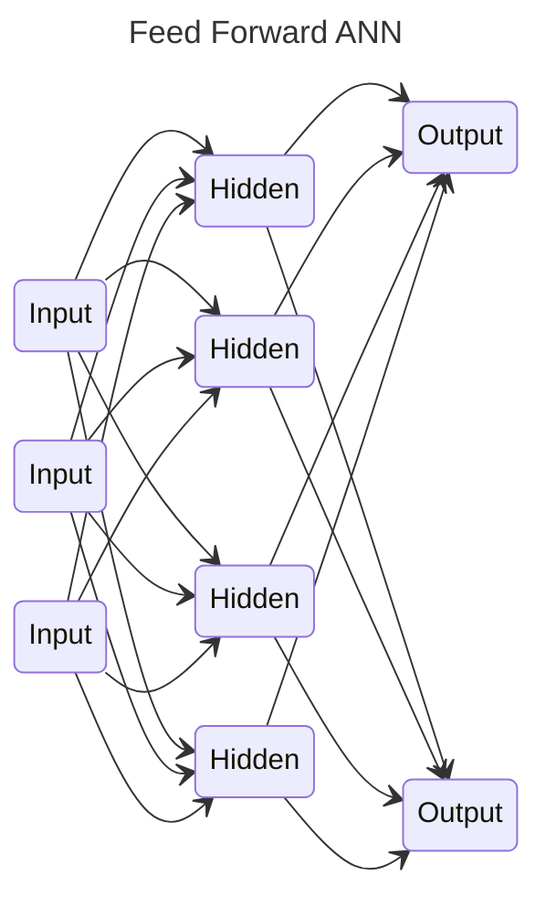
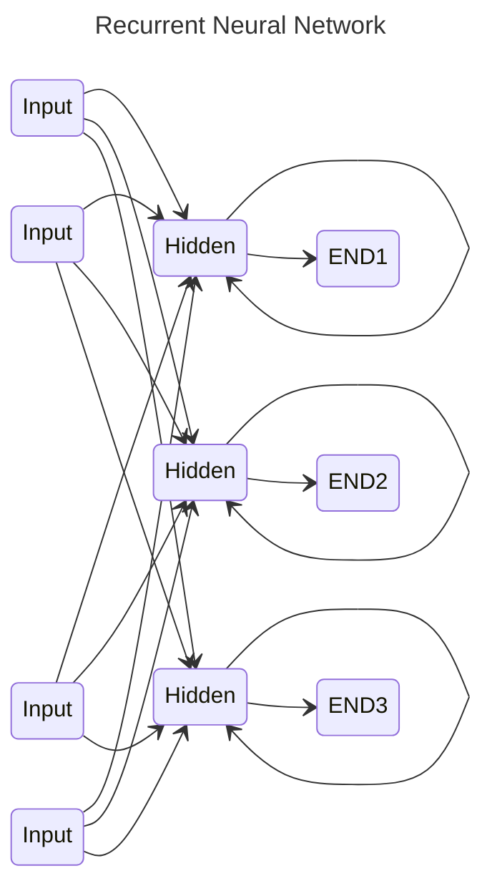

# Fake News Detector
In this project, I train a Long Short Term Memory (LSTM) network to detect fake news from a given news corpus. 
This project could be practically used by media companies to automatically predict whether the circulating news is fake 
or not. The process could be done automatically without having humans manually review thousands of news-related articles.

Key Objectives:
 * Apply python libraries to import and visualize dataset
 * Perform exploratory data analysis and plot word-cloud
 * Perform text data cleaning such as removing punctuation and stop words
 * Understand the concept of tokenizer.
 * Perform tokenizing and padding on text corpus to feed the deep learning model.
 * Understand the theory and intuition behind Recurrent Neural Networks and LSTM
 * Build and train the deep learning model
 * Access the performance of the trained model

---

## Problem Statement and Business Case
Right now, we live in a world of misinformation and fake news. The goal of this project is to detect fake news based on 
Recurrent Neural Networks.\
Natural Language Processors (NLP) work by converting words (text) into numbers.\
These numbers are then used to train AI/ML models to make predictions.\
AI/ML based fake news detectors are crucial for companies and media to automatically predict whether circulating news is
fake or not.\
In this case study, I will analyze thousands of news text snippets to detect if the news is fake or not.

---

## Architecture Overview

---

## Theory Behind Recurrent Neural Networks and LSTM
### Recurrent Neural Networks (RNN): What are they?
Feedforward Neural Networks (Vanilla Networks) map a fixed size input, like an image, to a fixed size output, such as
classes or probabilities.

A drawback of Feedforward Networks is that they do not have any time dependency or memory effects.

An RNN is a type of ANN that is designed to take temporal dimension into consideration by having a memory 
(internal state) (feedback loop).fc

### RNN Architecture
RNNs contain a temporal loop in which the hidden layer not only gives an output, but feeds itself as well.

Time is added as an extra dimension.

RNNs can recall what happened in the previous time stamp, so it works great with sequences of text.
